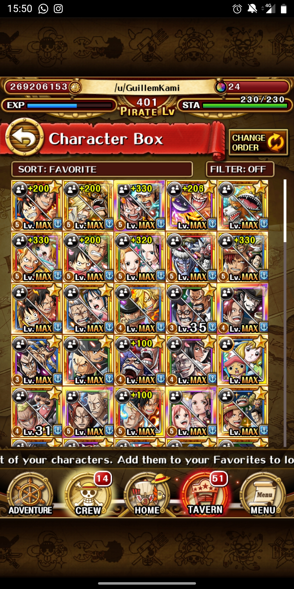
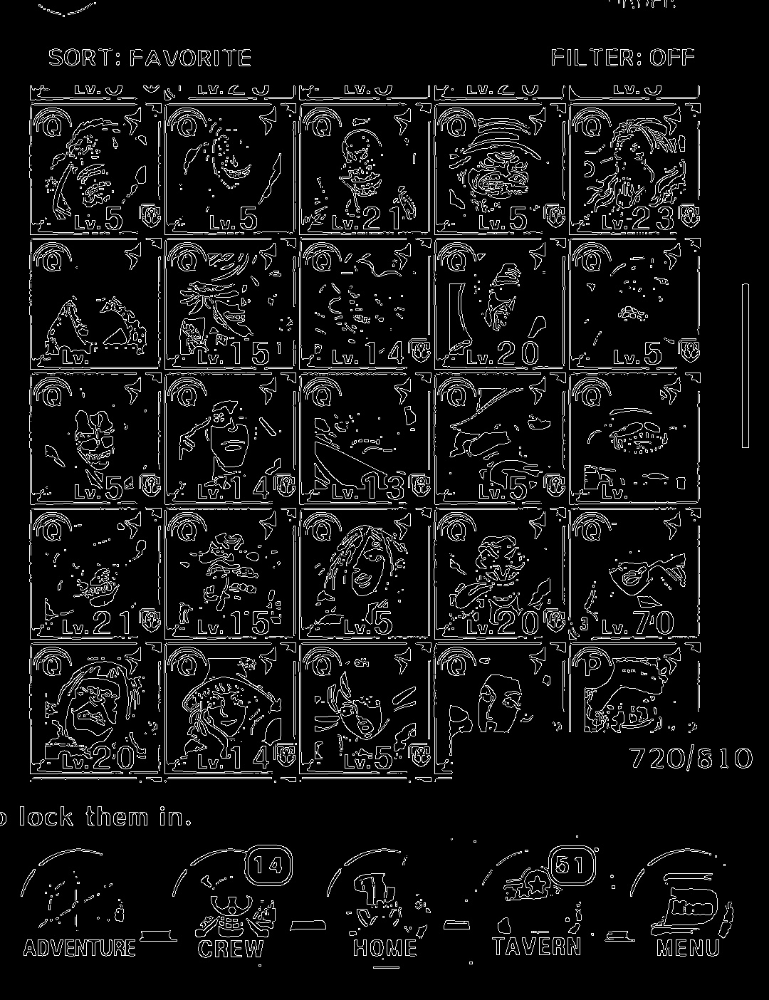
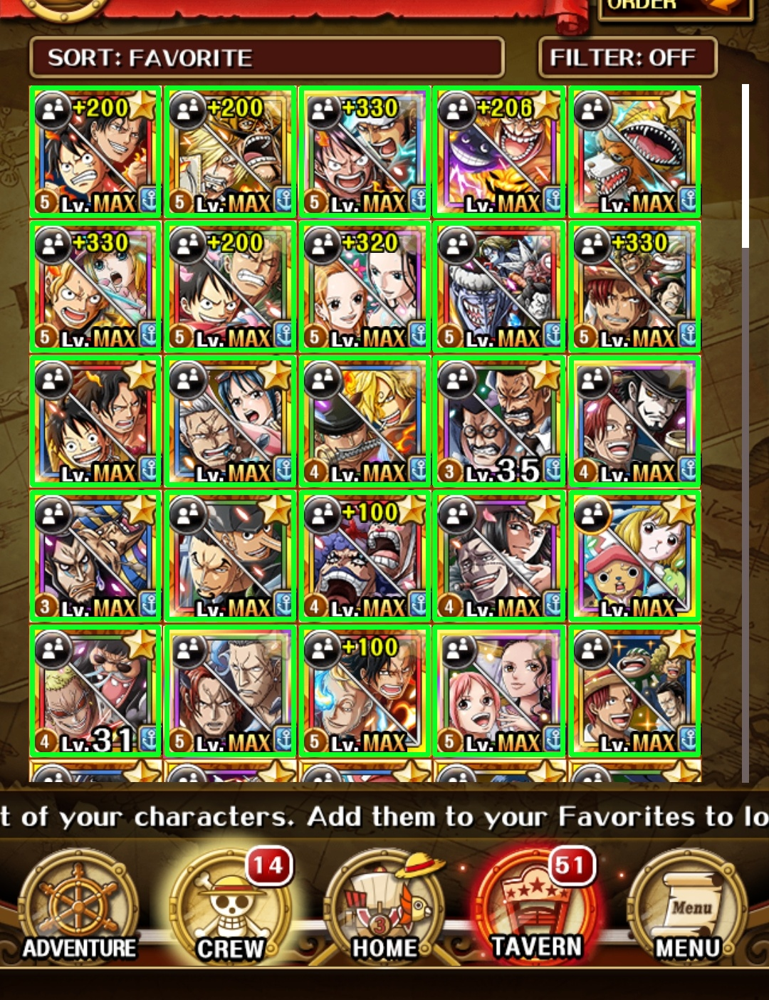
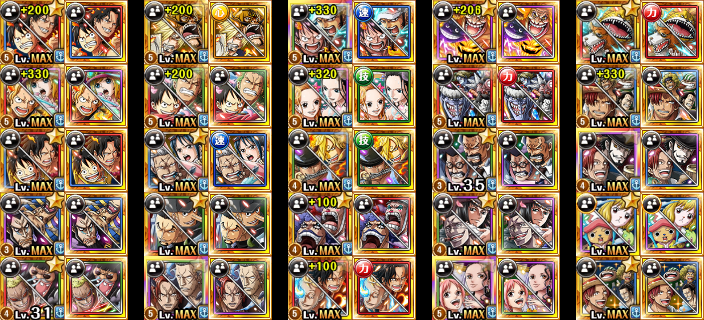

# OPTC Box Exporter (OPTCbx)

Export your OPTC character box automatically from screenshots.

OPTCbx can analyze your character box screenshots (*Figure 1*), and obtain all the 
characters within them. OPTCbx does that without any manual intervention.

OPTCbx is the first box exporter for One Piece Treasure Cruise without any manual
intervention. It works with just a set of screenshots.

<div>
    <p align="center">
        
    </p>
    <p align="center" style="text-align: center;"><i>Figure 1: Box Screenshot</i></p>
</div>

By its own, OPTCbx, does not have any utility apart from showing your character box in a fancy manner. 

Power comes with contributions. I believe that OPTCbx can be a key point
combined with projects such as:

- [NakamaNetwork](https://www.nakama.network/): With OPTCbx you are not far 
from automatically exporting your teams or your box to this extraordinary website.

- [CrewPlanner](https://www.reddit.com/r/OnePieceTC/comments/j60ueg/crew_planner_is_now_available/): Imagine that you can export all your characters to CrewPlanner without spending hours introducing your characters one by one. With OPTCbx, you
will be able to do so with just a few minutes or even seconds 😲.

- [TM Planner](https://lukforce.bitbucket.io/tm-planner/): OPTCbx would provide the ability to automatically select the 
characters that you don't own.

## Try it out (Web app)


## Try it out (Advanced users)

1. This project is fully implemented in Python, so make sure you have Python installed
in your computer.

2. Install the dependencies

```bash
$ pip install requirements.txt
```

3. Download the portraits

```bash
$ python -m optcbx download-portraits \
    --units data/units.json \
    --output data/Portraits
```

4. Run the demo with your screenshot

```bash
$ python -m optcbx demo <screenshot-path>
```

> Note: If OpenCV shows warnings regarding to png files, run the `fix.bat` 
inside `tools` directory

## How it works (Advanced users)

OPTCbx uses computer vision techniques combined with simple image comparison metrics to retrieve the characters sitting on your box and match them with the corresponding [OPTC database](https://optc-db.github.io/characters/#/search/) entries.

The used technologies are:

- [OpenCV](https://opencv.org/)
- [NumPy](https://numpy.org/)

### Step by step

Below I detail the methods used at each step:

1. **Retrieve character box portraits**: First keep only the high intensity colors such as white and yellow. Then with the resulting masked image I apply a canny edge detection (*Figure 2*) to obtain the character box borders.

<div>
    <p align="center">
        
    </p>
    <p align="center" style="text-align: center;"><i>Figure 2: Canny edge detection result</i></p>
</div>

2. Then with the Canny result, I apply an approach called [Hough Lines Transform](https://docs.opencv.org/3.4/d9/db0/tutorial_hough_lines.html) to detect vertical and horizontal lines to draw the box grid.

3. Finally, with the grid I am able to find the boxes wrapping each character (**Figure 3**). Then with these regions, cropping the characters one by one is straightforward.

<div>
    <p align="center">
        
    </p>
    <p align="center" style="text-align: center;"><i>Figure 3: Boxes wrapping characters</i></p>
</div>

4. **Finding matching characters**: To do so I compute a pairwise Mean Squared Error (*Equation 1*) distance with all the characters found in your box with all the database entries. Finally I pick the smallest distance (*Figure 4*).

<div>
    <p align="center">
        
    </p>
    <p align="center" style="text-align: center;"><i>Equation 1: MSE</i></p>
</div>

5. **Results**

<div>
    <p align="center">
        
    </p>
    <p align="center" style="text-align: center !important;"><i>Figure 4: Matched characters. For each column, the character appearing at the right is your character and the one at the left is the OPTC db entry (exported one)</i></p>
</div>
